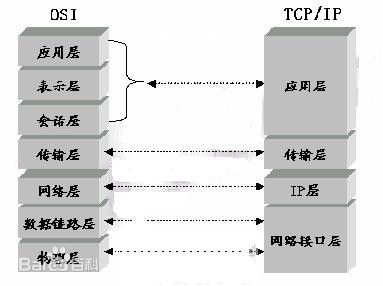

## 一、请列举几个常用的Vue指令。

1、v-model 多用于`表单元素`实现双向数据绑定

2、v-for 格式： v-for="字段名 in 数组json" 循环数组或json


3、v-show 显示内容  (css样式的display 显示和隐藏)

4、v-if    显示与隐藏 （dom元素的删除添加 默认值为false）

5、v-else-if  必须和v-if连用

6、v-else  必须和v-if连用  不能单独使用  否则报错   模板编译错误

7、v-bind  动态绑定  作用： 及时对页面的数据进行更改

- v-bind:class   三种绑定方法  
```
    对象型  '{red:isred}' 
    三元型  'isred?"red":"blue"'
    数组型  '[{red:"isred"},{blue:"isblue"}]'
```

8、v-on:click 给标签绑定函数，v-on:可以缩写为@，例如绑定一个点击函数  函数必须写在methods里面

9、v-text  解析文本

10、v-html   解析html标签

12、v-once  进入页面时  只渲染一次 不在进行渲染

13、v-cloak  防止闪烁

14、v-pre  把标签内部的元素原位输出
在模板中跳过vue的编译，直接输出原始值。就是在标签中加入v-pre就不会输出vue中的data值了。
```html
　　<div v-pre>{{message}}</div>
```
　　这时并不会输出我们的message值，而是直接在网页中显示{{message}}

## 二、请简述对Vue、React、Angular 三个框架的理解


一、Angular，它两个版本都是强主张的，如果你用它，必须接受以下东西：

- 必须使用它的模块机制
- 必须使用它的依赖注入
- 必须使用它的特殊形式定义组件（这一点每个视图框架都有，难以避免）

所以Angular是带有比较强的排它性的，如果你的应用不是从头开始，而是要不断考虑是否跟其他东西集成，这些主张会带来一些困扰。

二、React，它也有一定程度的主张，它的主张主要是函数式编程的理念，比如说，你需要知道什么是副作用，什么是纯函数，如何隔离副作用。它的侵入性看似没有Angular那么强，主要因为它是软性侵入。

三、Vue，可能有些方面是不如React，不如Angular，但它是渐进式的，没有强主张，你可以在原有大系统的上面，把一两个组件改用它实现，当jQuery用；也可以整个用它全家桶开发，当Angular用；还可以用它的视图，搭配你自己设计的整个下层用。你可以在底层数据逻辑的地方用设计模式的那套理念，也可以函数式，都可以，它只是个轻量视图而已，只做了自己该做的事，没有做不该做的事，仅此而已。

`渐进式的含义-个人理解：没有多做职责之外的事。`


## 三、请简述计算机网络原理


* 应用层 (Application)
网络服务与最终用户的一个接口。
协议有：HTTP FTP TFTP SMTP SNMP DNS TELNET HTTPS POP3 DHCP

* 表示层（Presentation Layer）
数据的表示、安全、压缩。（在五层模型里面已经合并到了应用层）
格式有，JPEG、ASCll、DECOIC、加密格式等

* 会话层（Session Layer）
建立、管理、终止会话。（在五层模型里面已经合并到了应用层）
对应主机进程，指本地主机与远程主机正在进行的会话

* 传输层 (Transport)
定义传输数据的协议端口号，以及流控和差错校验。
协议有：TCP UDP，数据包一旦离开网卡即进入网络传输层

* 网络层 (Network)
进行逻辑地址寻址，实现不同网络之间的路径选择。
协议有：ICMP IGMP IP（IPV4 IPV6） ARP RARP

* 数据链路层 (Link)
建立逻辑连接、进行硬件地址寻址、差错校验等功能。（由底层网络定义协议）
将比特组合成字节进而组合成帧，用MAC地址访问介质，错误发现但不能纠正。

* 物理层（Physical Layer）
建立、维护、断开物理连接。（由底层网络定义协议）

博客分享

[狗尾巴草的博客](https://www.cnblogs.com/bgwhite/)