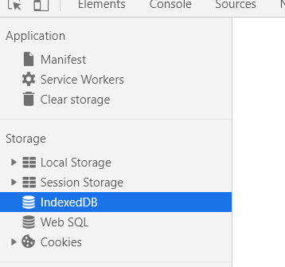
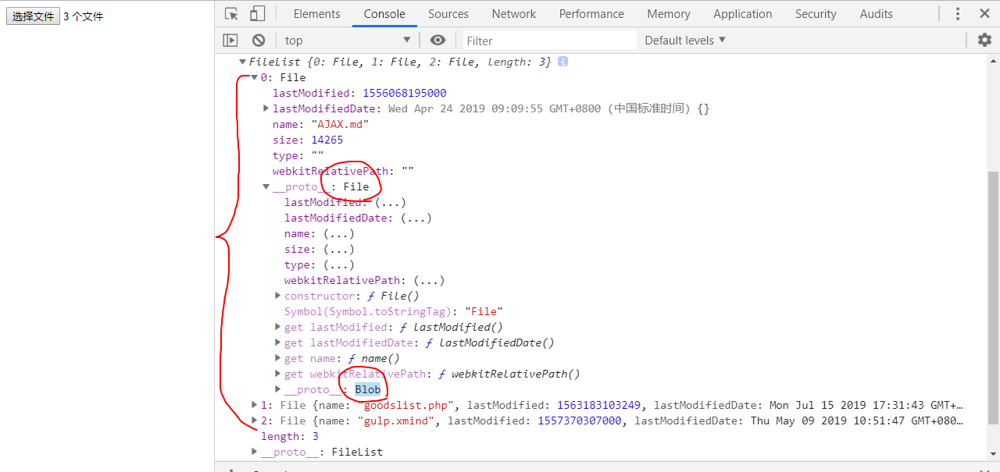

# cookie

前端有几种存储方式，用了最多就是cookie，sessionStorage，localStorage，indexDB，websql




cookie经常用于登录注册

如果前后端同域，拿cookie将会自动携带

如果是跨域，cookie不会携带到后端

不管get，post，put，delete或者其他请求，里面都有请求头和请求体，cookie是属于请求头部分

# 请求头和请求体

就是跨域情况下，是怎么样带不过去数据的。


# 跨域携带类似cookie

就是先解决跨域问题，cors，jsonp，就要把你的cookie放请求体里面，而不是放请求头，token令牌写法

把请求头的内容放请求体，来逃避跨域引起无法自动带请求头的问题，因为一切数据都可以解决跨域情况放在请求体携带

如果出现跨域你就不要用请求头传数据


# token

用户名和密码从前端携带到后端，

- 如果是跨域的话，只有一种选择就是把登录信息从请求体部分带到后端

- 如果同域怎么做都可以，你可以把数据放请求头也可以放请求体


由于登录注册，你第一次登录的时候是要验证用户名和密码的是否跟后端匹配，所以携带，用户名和密码过去后端校验

登录注册是一个持久登录，比如是十天免登录

如果像上面那种做法，需要每次都把用户名和密码发过去，那这样会非常不安全，怎么办？

第一次允许带真的用户名和密码过来验证，如果成功，后端给你发一个手牌

前端拿公共钥匙，后端拿私钥


如果你在第二次继续保持发密码的话，那这样很大增加你的危险，后端处理量很大，数据库

所以后端第二次，发令牌

```
abc

123 (123+1-78)*56 = xxxx
```

后端

token

利用node的crypto模块实现加密和解密

```js
var crypto = require("crypto");
```
后端拿到密码先加密一些登录数据，如果是判断登录成功的话，那就会生成一个登录手牌，而这个手牌记录你的用户名关键信息，后端把手牌发送给前端，然后把手牌存到cookie（具时效性），第二次前端发起登录请求，不需要再发用户名和密码，考虑跨域和非跨域的情况把它放进请求头或者请求体
```js
const {
    createToken,
    decodeToken
} = require('./token');

// 后端在这里用算法生成了一块手牌，里面携带了关键的登录注册信息
const token = createToken({
    username: 'yao',
}, 300);

console.log(token);
```
然后后端拿到这个手牌，只要验证手牌是否合法就可以知道是否登录成功，如果需要更关键的信息，去用解密，把手牌的信息给解析出来


- decodeToken 完全解析令牌
- checkToken 只校验令牌是否合法

```js
const obj = decodeToken('eyJkYXRhIjp7InVzZXJuYW1lIjoieWFvIiwicGFzc3dvcmQiOjEyM30sImNyZWF0ZWQiOjE1NjM3NjIxMjMsImV4cCI6MzAwfQ==.8n30p9ufgWY2VBOeEiY3jBArjpC9XCLis4MYrNdJhmU=');
```

上面这种还是后端单方面加密和解密，真正的非对称需要把签名，对半分两段，前端是公钥，后端是私钥，每次前端需要把公钥带上数据，发给后端，经过后端加密生成令牌。

```js
var secret = "piggyyao.com";
```

- 需要同时获取前后端的钥匙
- 模拟令牌

复杂度

```
1L-VBFKtUvg_Uvr5oqmgRPVtWy2Ps9Jq0j-AxLZLTc0ZyrEx
64*64
10+26*2+2 = 64

255.255.255.255

255四次方
```

# express配合token

后端加密
```js
router.post('/token', async function (req, res, next) {
    console.log(req.cookies)
    let {
        username,
        password,
    } = req.body;
    // 先去数据库查询是否存在该用户，如果有就发牌
    let token = createToken({
        username
    }, 300)
    res.json({
        status: 'success',
        token
    })
});
```
后端解码
```js
router.post('/checkToken', async function (req, res, next) {
    console.log(req.cookies)
    let {
        token
    } = req.cookies;
    console.log(token);
    let detail = decodeToken(token)
    res.json({
        detail
    })
});
```

# 缺点

跨域的时候，只能在请求体里面带

优化读数据库时间，但是增加了CPU损耗


# 上传/下载

上传头像，上传视频，图片，音频

- [文件上传1](https://github.com/wscats/node-tutorial/tree/master/tutorial/express/multer)
- [源代码1](https://github.com/Wscats/node-tutorial/tree/master/uploadFiles)

```html
<!-- 单选 -->
<input type="file" />
<!-- 多选 -->
<input type="file" multiple />
```

我们使用input标签，选中文件，然后通过ajax方法把文件提交到后端，此时上传，一般情况是post。



监听input节点变化，并获取该节点files对象，你的选择文件，选中多少个，那这个对象就会有多少个内容
```js
var file = document.querySelector("#file");
file.addEventListener("change", (e) => {
    console.log(e);
    console.log(file.files);
})
```

就要把这些对象用ajax上传，在平时我们上传都是json格式，但是我把它改为流的形式上传，我们无法使用json字符串去表示我们的文件内容，因为文件有可能视频音频或者图片，所以我们使用二进制流的传输方式

```js
xmlhttp.setRequestHeader('Content-Type', 'application/octet-stream');
```
把流放进请求体里面，然后传输给后端
```js
xmlhttp.send(blob);
```

完整的前端上传逻辑——前端知道这个就行了！
```html
<!DOCTYPE html>
<html lang="en">
<head>
    <meta charset="UTF-8">
    <meta name="viewport" content="width=device-width, initial-scale=1.0">
    <meta http-equiv="X-UA-Compatible" content="ie=edge">
    <title>Document</title>
</head>
<body>
    <input type="file" multiple id="file" />
    <script>
        // 选中节点
        var file = document.querySelector("#file");
        file.addEventListener("change", (e) => {
            console.log(e);
            // 选中第一个文件
            console.log(file.files[0]);
            let blob = file.files[0];
            // ajax上传
            var xmlhttp = new XMLHttpRequest();
            //设置回调，当请求的状态发生变化时，就会被调用  
            xmlhttp.onreadystatechange = function () {
                //上传成功，返回的文件名，设置到父节点的背景中  
                if (xmlhttp.readyState == 4 && xmlhttp.status == 200) {
                    console.log(xmlhttp.responseText);
                }
            }
            // 更改传输的方式
            xmlhttp.setRequestHeader('Content-Type', 'application/octet-stream');
            xmlhttp.open("POST", "http://localhost:3000/sign/upload");
            // 把图片音频等以流形式在请求体装载好，发送给后端
            xmlhttp.send(blob);
            file.value = null;
        })
    </script>
</body>
</html>
```

后端用http(express代替)模块接受这些流，然后通过fs模块写入到硬盘。

req请求是一个流，但是一般情况下我们根本不需要知道它是否是流，因为express帮你封装了很多的req.xxx方法，请求体的内容将会被解析到req的对象属性里面用于后端逻辑开发。

```js
req.cookie
req.body
req.query
req.header
```

因为当时node在处理来自于客户端的数据的时候，我们根本不知道你的数据多大，多小

它会把数据慢慢写入到内存里面，你就从内存把它拿出来转化，还是写硬盘，还是做逻辑

所以req一开始设计为流，为了应变吸纳大量数据而准备的

我需要先加载流，然后在通过fs把流写入进来

- fs.createReadStream(path[, options])
- fs.createWriteStream(path[, options])

```js
// 一次性加载 小型数据
fs.readFile();
// 慢慢加载
fs.createReadStream(); //req就是这种方法创建的 大型数据
```
express通过流提供的pipe方法，把前端传来的流写入到硬盘
```js
const http = require('http');
const fs = require('fs');
http.createServer((req, res) => {
    // 跨域
    res.setHeader('Access-Control-Allow-Origin', '*');
    // 必须要设置
    res.setHeader('Access-Control-Allow-Headers', 'Origin, X-Requested-With, Content-Type, Accept');
    req.pipe(fs.createWriteStream('./pic.png'));
    res.end('success');
}).listen(8877);
```

express实现这个方案

# multer

帮你基于express封装了一个上传的模块

它是一个处理上传的中间件

# 下载

把资源文件放到服务器静态文件夹，然后获取路径，给前端，配合a等其他方式进行下载
```html
<a href="/images/myw3schoolimage.jpg" download="w3logo">
```